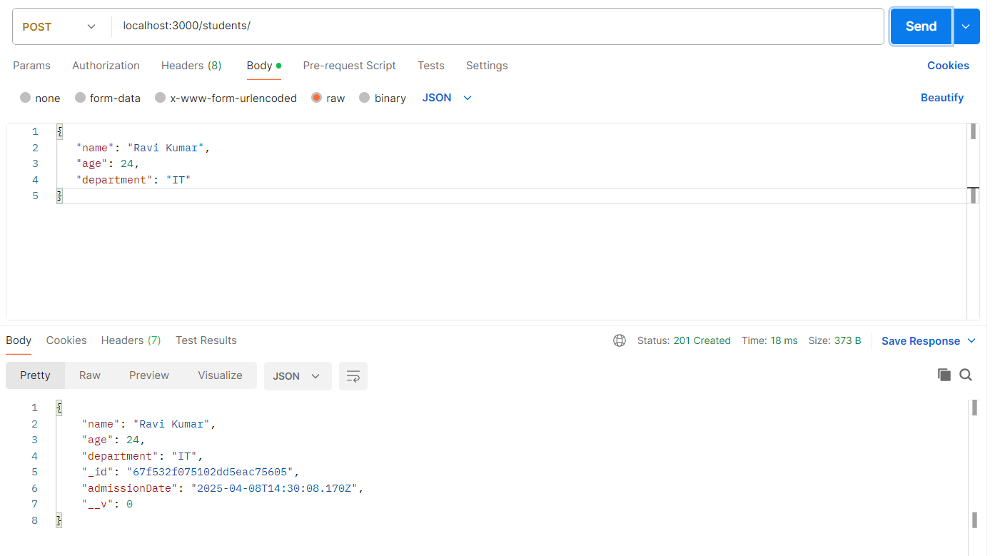
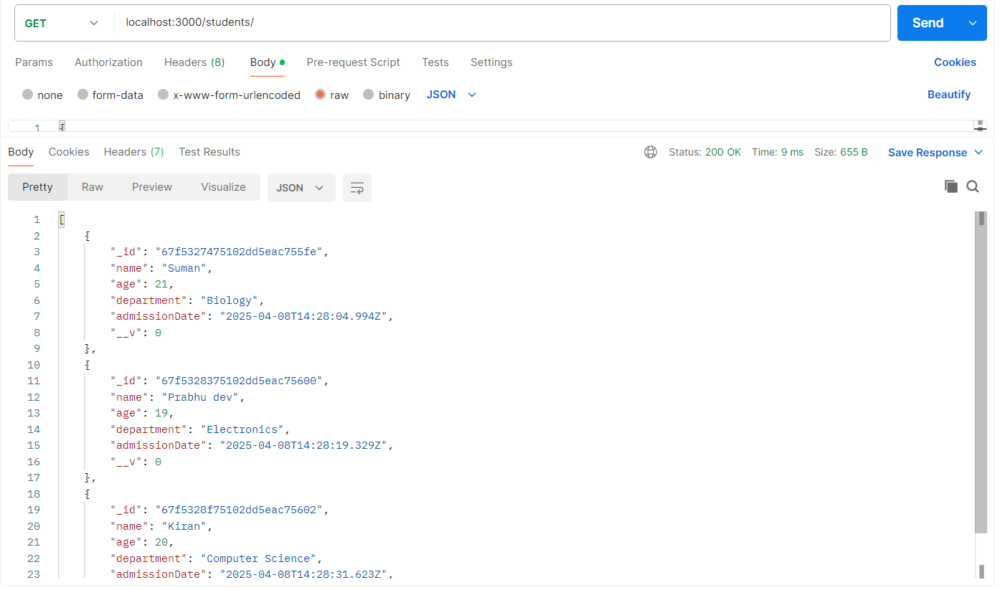
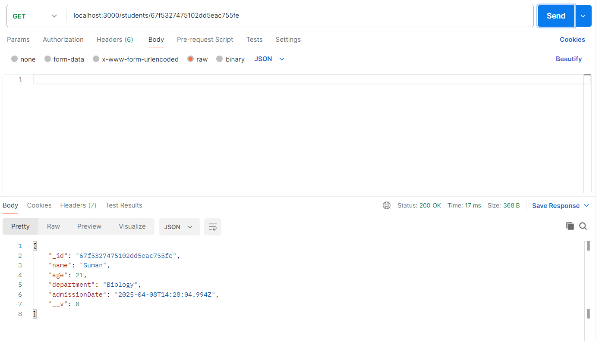
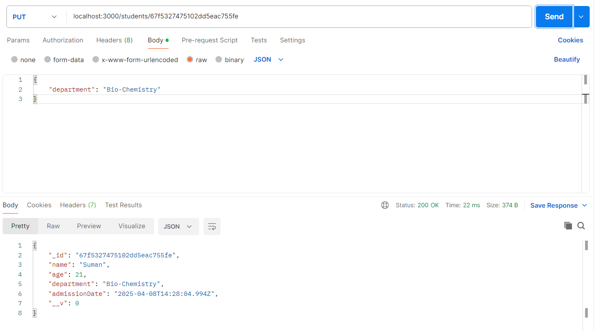
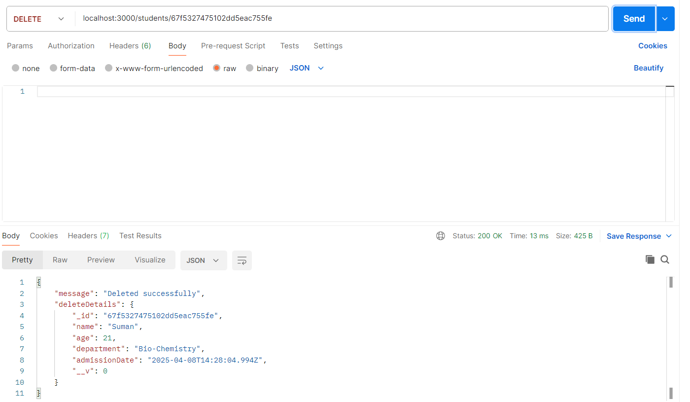

# Student Management API

## Setup Instructions

1. **Clone the repository**

```bash
git clone https://github.com/GnaniSai/student-management-api.git

cd student-management-api
```

2. **Install Dependencies**

```bash
npm install
```
3. **Create .env File**

* `Include necessary values as provided in .env.example.`

4. **Run the Server**

```bash
npm start
```

5. **Test the API in Postman/Thunder Client**

* URL: `http://localhost:3000/students`

## API Endpoints Summary
| Method  | Endpoint                           | Descirption                   | Body/Params               |
|---------|------------------------------------|-------------------------------|---------------------------|
| GET     | http://localhost:3000/students     | Get All Student Details       | -                         |
| GET     | http://localhost:3000/students/:id | Get a Student Details by id   | :id (url path)            |
| POST    | http://localhost:3000/students     | Create a new Student Details  | { name, age, department } |
| PUT     | http://localhost:3000/students/:id | Update a Student Details by id| { name, age, department } |
| DELETE  | http://localhost:3000/students/:id | Delete a Student Details by id| :id (url path)            |

## Sample test data

```json
{
   "name": "Suman",
   "age": 21,
   "department": "Biology"
}

{
   "name": "Prabhu dev",
   "age": 19,
   "department": "Electronics"
}

{
   "name": "Kiran",
   "age": 20,
   "department": "Computer Science"
}

{
   "name": "Ravi Kumar",
   "age": 24,
   "department": "IT"
}
```

## API Test Screenshots

#### 1. Create Student


#### 2. Get All Students


#### 3. Get Student By id


#### 4. Update Student By id


#### 5. Delete Student By id



